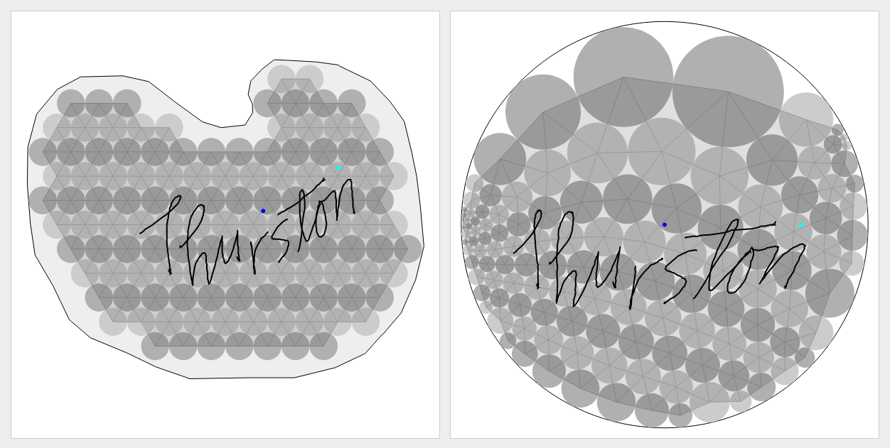

# Visualizing circle-packing conformal maps

Check out the live demo at <https://kwshi.github.io/thurston>!

**Riemann's mapping theorem** states the following. Suppose 𝑈 is a non-empty, proper open subset of ℂ and that 𝑈 is simply-connected, and let 𝑧₀,𝑧₁∈𝑈. Then there exists a unique biholomorphism 𝜙: 𝑈→𝔻 (where 𝔻 denotes the unit disk), with the property that 𝜙(𝑧₀)=0, and 𝜙(𝑧₁) lands on the positive-real axis.

**Thurston's conjecture** (also sometimes known as the **discrete/finite Riemann mapping theorem**) provides an insightful (and pretty!) construction/visualization of the Riemann mapping theorem, proceeding roughly as follows:

1. Given a (bounded) domain 𝑈, approximately triangulate 𝑈 via a hexagonal circle-packing of radius 𝜖.

2. Carefully resize each circle to obtain a new packing _with the same tangency structure_ that fits “maximally” within the unit disk; i.e., boundary circles end up tangent to the boundary of the disk. This results in a mapping from circles in the original domain 𝑈 to circles in 𝔻.

3. Map each triangle in 𝑈 (as defined by the centers of three mutually-tangent circles) to the corresponding triangle in 𝔻 by a (uniquely-determined) affine map; gluing each piece together gives a map defined on the full triangulation.

4. Apply a (Möbius) disk automorphism to send the image of 𝑧₀ to 0, and rotate the image of 𝑧₁ onto the real axis.

5. As 𝜖 tends to zero, the map constructed in this manner gradually tends to the Riemann map 𝜙: 𝑈→𝔻.

This app is an interactive demonstration of this process. Check it out here: <https://kwshi.github.io/thurston>.

# References

(Note: this list of references may be incomplete, because I haven't had the time to properly document each component of this app.)

- Most of the mathematical content/know-how for this project came from taking Terry Tao's complex analysis course at UCLA (Math 246C, spring 2023) in the unit on circle-packings and quasiconformal maps. In fact, this project was created as an assigned final project for this course. Notes for this subject are [publicly available on Terry Tao's blog](https://terrytao.wordpress.com/2018/04/12/246c-notes-2-circle-packings-conformal-maps-and-quasiconformal-maps/).

- The hexagonal circle-fitting algorithm (where, given an arbitrary polygon, the interior circle-packing/triangulation is computed) is a customization of the ray-casting algorithm used to solve the [point in polygon](https://en.wikipedia.org/wiki/Point_in_polygon) problem.

- The circle-packing algorithm is a simplified version of [Collins &amp; Stephenson's original algorithm](<https://doi.org/10.1016/S0925-7721(02)00099-8>) based on local relaxation of radii and a "uniform neighbor model".

- Some inspiration for this project came from [Beeker &amp; Loustau's implementation of a similar app using C++ and Qt](https://brice.loustau.eu/circlepackings/indexen.html). In particular, [this screenshot of their app](https://brice.loustau.eu/ressources/circlepackings2.png) looked really cool, and I wanted to recreate it, but I was dismayed to find that all of the download/installation links on their website were broken (at least, when I last checked), and I couldn't get their program to compile correctly. Plus, I figured, a version that runs on the web would ultimately end up being more accessible than a version that requires downloading and installing.

# Disclaimer

This project is incomplete! I'm still working on polishing it, adding features, etc. If you have any suggestions, please feel free to create a GitHub issue.
